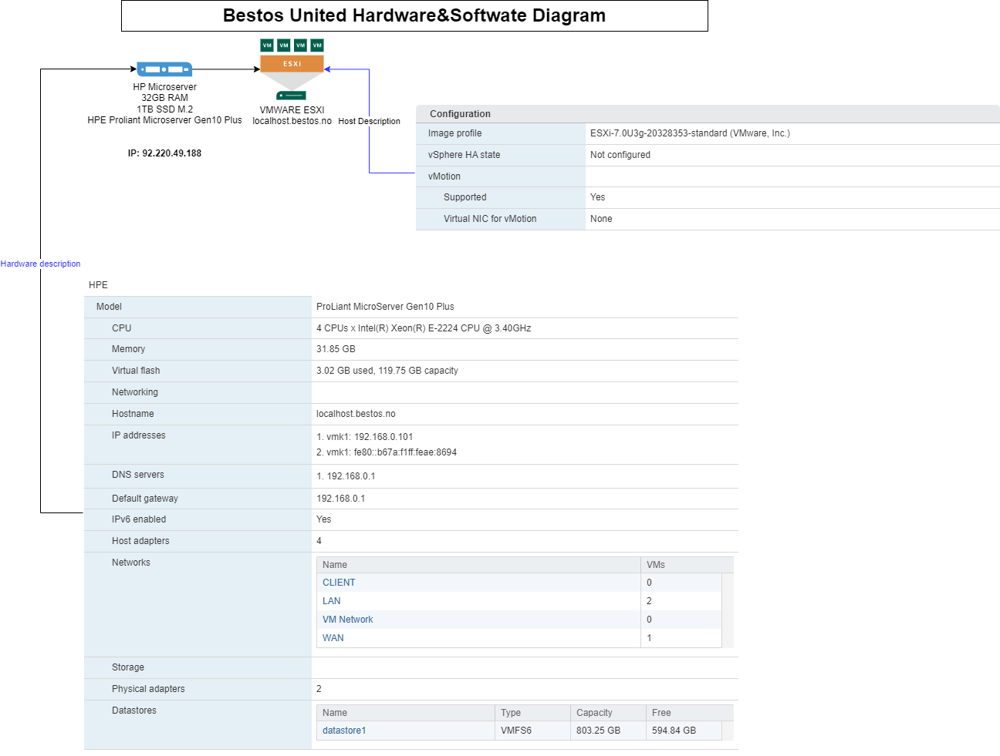
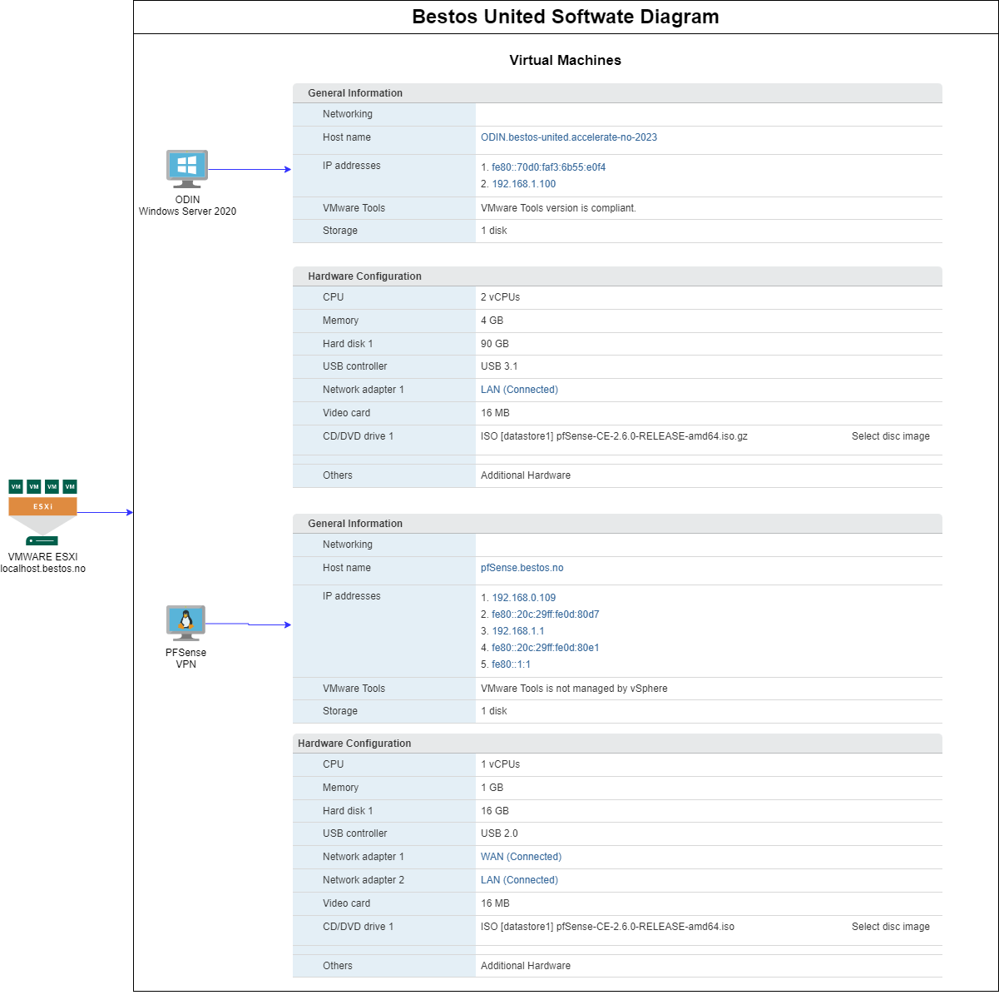

# Overview

This section shows all the connection settings in our onPrem environment.
Diagrams and configurations are stored as well.

## HP Microserver

* 32GB RAM
* Hard drive 2TB

### IP Address

92.220.49.188

1. Navigate to the following portal <https://92.220.49.188>

2. Retrieve User and password from its corresponding KeyVault (**No User nor passwords will be documented here**)

## Steps to enable remote access to vmhost via https

1- Added DMZ host as shown in the picture which is WAN IP address in my tplink router

2- From Tplink router, i added forwarding to the ip address of the VMWare host which is in LAN network of router as shown in the image below

## Architecture Diagram

## Domain server and active directory installation

Followed steps mentioned in this article
<https://computingforgeeks.com/install-active-directory-domain-services-in-windows-server/?utm_content=cmp-true>

## Available virtual machines

### Windows Server 2022

Host name: ODIN

#### Active directory

Users have been granted on-prem access to the system, login organization settings are:
Logon name  : `<user name>@bestos-united.accelerate-no-2023`
Logon name (Pre windows 2000) : BESTOS-UNITED\<user name>

### Azure Pipelines agent

An agent has been configured to work with Azure DevOps. This feature will allow the team to run pipelines under this agent fully available and azure independent.
Agent has been configured to run as a service.

### PFSense

